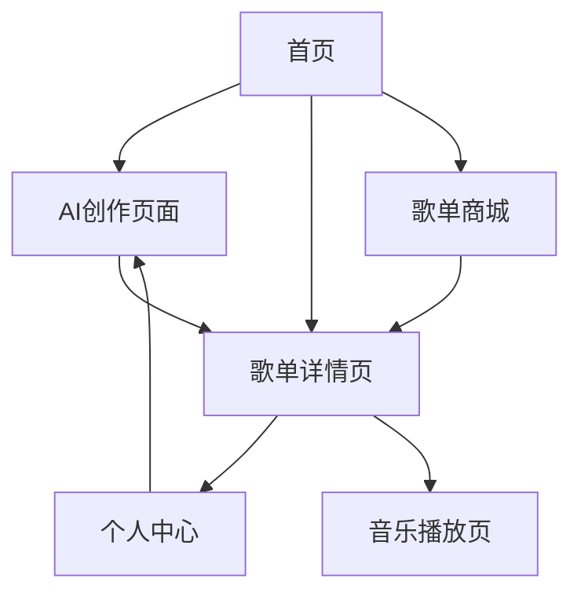

## 1. 产品概述

AI 音乐是一个音乐创作平台，用户可以利用 AI 技术创建个性化歌单，分享和收藏音乐。平台提供创作入口和歌单商城，让音乐爱好者能够发现、创作和分享音乐内容。

目标用户为音乐爱好者、创作者和分享者，通过 AI 技术降低音乐创作门槛，提供个性化音乐体验。

## 2. 核心功能

### 2.1 用户角色

| 角色     | 注册方式        | 核心权限                                     |
| -------- | --------------- | -------------------------------------------- |
| 普通用户 | 邮箱/手机号注册 | 浏览音乐、创建歌单、收藏音乐、基础 AI 创作   |
| 创作者   | 申请认证        | 发布原创音乐、高级 AI 创作工具、参与歌单商城 |
| VIP 用户 | 付费升级        | 无限制 AI 创作、高品质音乐、优先体验新功能   |

### 2.2 功能模块

AI 音乐网站包含以下核心页面：

1. **首页**：音乐推荐、热门歌单、创作入口、导航栏
2. **AI 创作页面**：AI 歌单生成、音乐风格选择、个性化推荐
3. **歌单详情页**：歌单展示、播放控制、收藏分享、评论互动
4. **个人中心**：我的歌单、收藏音乐、创作历史、个人设置
5. **歌单商城**：精品歌单展示、购买分享、创作者专区
6. **音乐播放页**：播放器界面、歌词显示、播放列表

### 2.3 页面详情

| 页面名称    | 模块名称   | 功能描述                                         |
| ----------- | ---------- | ------------------------------------------------ |
| 首页        | 导航栏     | 网站 Logo、搜索框、用户登录入口、创作入口按钮    |
| 首页        | 推荐音乐   | 基于 AI 算法的个性化音乐推荐，支持刷新获取新推荐 |
| 首页        | 热门歌单   | 展示热门和用户喜爱的歌单，支持分类筛选           |
| 首页        | 创作入口   | 醒目的 AI 创作按钮，引导用户进入创作页面         |
| AI 创作页面 | 风格选择   | 提供多种音乐风格选项（流行、摇滚、电子、古典等） |
| AI 创作页面 | 情绪选择   | 选择音乐情绪（快乐、悲伤、激昂、舒缓等）         |
| AI 创作页面 | 场景选择   | 选择使用场景（工作、运动、休闲、睡眠等）         |
| AI 创作页面 | 生成按钮   | 一键生成个性化歌单，显示生成进度                 |
| AI 创作页面 | 预览编辑   | 预览生成的歌单，支持手动调整和重新生成           |
| 歌单详情页  | 歌单信息   | 显示歌单封面、标题、简介、创建者信息             |
| 歌单详情页  | 播放控制   | 播放/暂停、上一首/下一首、进度条、音量控制       |
| 歌单详情页  | 歌曲列表   | 显示歌单内所有歌曲，支持拖拽排序                 |
| 歌单详情页  | 互动功能   | 收藏、分享、评论、点赞功能                       |
| 个人中心    | 我的歌单   | 展示用户创建的所有歌单，支持编辑和删除           |
| 个人中心    | 收藏音乐   | 显示用户收藏的歌曲和歌单                         |
| 个人中心    | 创作历史   | 记录用户的 AI 创作历史和生成结果                 |
| 个人中心    | 个人设置   | 修改个人信息、密码、通知设置等                   |
| 歌单商城    | 精品推荐   | 展示高质量的付费歌单和免费精选                   |
| 歌单商城    | 分类浏览   | 按风格、场景、价格等分类浏览歌单                 |
| 歌单商城    | 创作者专区 | 展示认证创作者的作品和简介                       |
| 音乐播放页  | 播放器     | 底部固定播放器，支持最小化和展开                 |
| 音乐播放页  | 歌词显示   | 同步显示歌词，支持歌词搜索和跳转                 |
| 音乐播放页  | 播放模式   | 支持单曲循环、列表循环、随机播放等模式           |

## 3. 核心流程

### 普通用户流程

用户访问首页 → 浏览推荐音乐 → 点击 AI 创作 → 选择偏好设置 → 生成个性化歌单 → 预览并保存 → 分享到社区或收藏

### 创作者流程

用户注册 → 申请创作者认证 → 获得创作权限 → 使用高级 AI 工具 → 发布原创歌单 → 参与歌单商城 → 获得收益

### 歌单商城流程

浏览商城 → 选择感兴趣的歌单 → 查看详情和评价 → 购买或收藏 → 在个人中心管理已购歌单

## 4. 用户界面设计

### 4.1 设计风格

- **主色调**：深黑色（#000000）作为背景，营造沉浸式音乐体验
- **辅助色**：深灰色（#1a1a1a）用于卡片背景，紫色（#9c27b0）作为强调色
- **按钮样式**：圆角矩形设计，hover 效果使用渐变色变化
- **字体选择**：主标题使用思源黑体，正文使用系统默认字体
- **布局风格**：卡片式布局，左右分栏设计，突出内容展示
- **图标风格**：线性图标，简洁现代，与音乐主题相关

### 4.2 页面设计概述

| 页面名称    | 模块名称 | UI 元素                                                         |
| ----------- | -------- | --------------------------------------------------------------- |
| 首页        | 导航栏   | 黑色背景，白色文字，Logo 居中，搜索框圆角设计，按钮使用紫色强调 |
| 首页        | 推荐音乐 | 横向卡片滑动，封面图圆角，标题白色，艺术家名淡灰色              |
| 首页        | 热门歌单 | 网格布局，每行 4-6 个卡片，悬停时有缩放动画效果                 |
| AI 创作页面 | 风格选择 | 圆形选择按钮，选中状态显示紫色边框，选项以图标+文字形式展示     |
| AI 创作页面 | 生成按钮 | 大尺寸紫色按钮，带有生成动画效果，进度条显示                    |
| 歌单详情页  | 播放控制 | 底部固定播放栏，黑色半透明背景，控制按钮居中排列                |
| 个人中心    | 标签页   | 顶部标签切换，当前选中标签显示底部紫色线条                      |
| 歌单商城    | 商品卡片 | 包含封面、标题、价格、评分，购买按钮醒目显示                    |

### 4.3 响应式设计

- **桌面优先**：主要面向桌面端用户，提供完整的音乐创作和浏览体验
- **移动端适配**：支持平板和手机访问，采用响应式布局
- **触摸优化**：按钮和交互元素适合触摸操作，滑动手势支持
