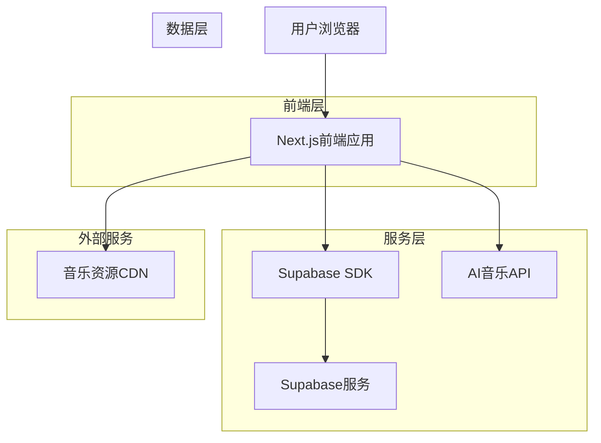
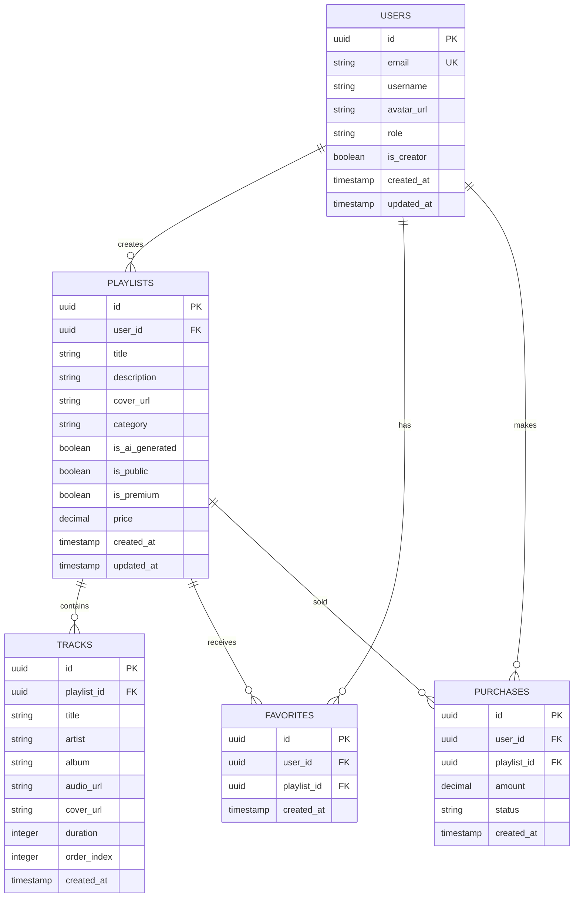

## 1. 架构设计



## 2. 技术描述

* **前端**: Next.js\@14 + React\@18 + TypeScript + Tailwind CSS

* **初始化工具**: create-next-app

* **后端**: Supabase (BaaS)

* **数据库**: Supabase PostgreSQL

* **认证**: Supabase Auth

* **存储**: Supabase Storage

* **AI服务**: 外部AI音乐生成API

## 3. 路由定义

| 路由              | 用途                |
| --------------- | ----------------- |
| /               | 首页，展示推荐音乐和热门歌单    |
| /create         | AI创作页面，生成个性化歌单    |
| /playlist/\[id] | 歌单详情页，展示歌单内容和播放功能 |
| /profile        | 个人中心，管理个人歌单和收藏    |
| /marketplace    | 歌单商城，浏览和购买精品歌单    |
| /player         | 音乐播放器页面           |
| /auth/login     | 用户登录页面            |
| /auth/register  | 用户注册页面            |
| /auth/callback  | 认证回调页面            |

## 4. API定义

### 4.1 用户认证API

```
POST /api/auth/login
```

请求参数：

| 参数名      | 参数类型   | 是否必需 | 描述   |
| -------- | ------ | ---- | ---- |
| email    | string | 是    | 用户邮箱 |
| password | string | 是    | 用户密码 |

响应参数：

| 参数名     | 参数类型   | 描述        |
| ------- | ------ | --------- |
| user    | object | 用户信息      |
| session | object | 会话信息      |
| error   | string | 错误信息（如果有） |

### 4.2 AI创作API

```
POST /api/ai/create-playlist
```

请求参数：

| 参数名    | 参数类型   | 是否必需 | 描述   |
| ------ | ------ | ---- | ---- |
| style  | string | 是    | 音乐风格 |
| mood   | string | 是    | 音乐情绪 |
| scene  | string | 是    | 使用场景 |
| userId | string | 是    | 用户ID |

响应参数：

| 参数名        | 参数类型   | 描述      |
| ---------- | ------ | ------- |
| playlistId | string | 生成的歌单ID |
| tracks     | array  | 音乐列表    |
| status     | string | 生成状态    |

### 4.3 歌单管理API

```
GET /api/playlists
```

请求参数：

| 参数名      | 参数类型   | 是否必需 | 描述       |
| -------- | ------ | ---- | -------- |
| userId   | string | 否    | 用户ID（可选） |
| category | string | 否    | 分类筛选     |
| limit    | number | 否    | 返回数量限制   |

响应参数：

| 参数名       | 参数类型   | 描述   |
| --------- | ------ | ---- |
| playlists | array  | 歌单列表 |
| total     | number | 总数   |

## 5. 数据库架构

### 5.1 数据模型定义



### 5.2 数据定义语言

用户表 (users)

```sql
-- 创建用户表
CREATE TABLE users (
    id UUID PRIMARY KEY DEFAULT gen_random_uuid(),
    email VARCHAR(255) UNIQUE NOT NULL,
    username VARCHAR(100) NOT NULL,
    password_hash VARCHAR(255) NOT NULL,
    avatar_url TEXT,
    role VARCHAR(20) DEFAULT 'user' CHECK (role IN ('user', 'creator', 'admin')),
    is_creator BOOLEAN DEFAULT FALSE,
    created_at TIMESTAMP WITH TIME ZONE DEFAULT NOW(),
    updated_at TIMESTAMP WITH TIME ZONE DEFAULT NOW()
);

-- 创建索引
CREATE INDEX idx_users_email ON users(email);
CREATE INDEX idx_users_username ON users(username);
```

歌单表 (playlists)

```sql
-- 创建歌单表
CREATE TABLE playlists (
    id UUID PRIMARY KEY DEFAULT gen_random_uuid(),
    user_id UUID REFERENCES users(id) ON DELETE CASCADE,
    title VARCHAR(255) NOT NULL,
    description TEXT,
    cover_url TEXT,
    category VARCHAR(50),
    is_ai_generated BOOLEAN DEFAULT FALSE,
    is_public BOOLEAN DEFAULT TRUE,
    is_premium BOOLEAN DEFAULT FALSE,
    price DECIMAL(10,2) DEFAULT 0.00,
    play_count INTEGER DEFAULT 0,
    like_count INTEGER DEFAULT 0,
    created_at TIMESTAMP WITH TIME ZONE DEFAULT NOW(),
    updated_at TIMESTAMP WITH TIME ZONE DEFAULT NOW()
);

-- 创建索引
CREATE INDEX idx_playlists_user_id ON playlists(user_id);
CREATE INDEX idx_playlists_category ON playlists(category);
CREATE INDEX idx_playlists_public ON playlists(is_public);
```

音乐表 (tracks)

```sql
-- 创建音乐表
CREATE TABLE tracks (
    id UUID PRIMARY KEY DEFAULT gen_random_uuid(),
    playlist_id UUID REFERENCES playlists(id) ON DELETE CASCADE,
    title VARCHAR(255) NOT NULL,
    artist VARCHAR(255) NOT NULL,
    album VARCHAR(255),
    audio_url TEXT NOT NULL,
    cover_url TEXT,
    duration INTEGER, -- 秒数
    order_index INTEGER DEFAULT 0,
    created_at TIMESTAMP WITH TIME ZONE DEFAULT NOW()
);

-- 创建索引
CREATE INDEX idx_tracks_playlist_id ON tracks(playlist_id);
CREATE INDEX idx_tracks_order ON tracks(playlist_id, order_index);
```

收藏表 (favorites)

```sql
-- 创建收藏表
CREATE TABLE favorites (
    id UUID PRIMARY KEY DEFAULT gen_random_uuid(),
    user_id UUID REFERENCES users(id) ON DELETE CASCADE,
    playlist_id UUID REFERENCES playlists(id) ON DELETE CASCADE,
    created_at TIMESTAMP WITH TIME ZONE DEFAULT NOW(),
    UNIQUE(user_id, playlist_id)
);

-- 创建索引
CREATE INDEX idx_favorites_user_id ON favorites(user_id);
CREATE INDEX idx_favorites_playlist_id ON favorites(playlist_id);
```

购买记录表 (purchases)

```sql
-- 创建购买记录表
CREATE TABLE purchases (
    id UUID PRIMARY KEY DEFAULT gen_random_uuid(),
    user_id UUID REFERENCES users(id) ON DELETE CASCADE,
    playlist_id UUID REFERENCES playlists(id) ON DELETE CASCADE,
    amount DECIMAL(10,2) NOT NULL,
    status VARCHAR(20) DEFAULT 'completed' CHECK (status IN ('pending', 'completed', 'refunded')),
    created_at TIMESTAMP WITH TIME ZONE DEFAULT NOW()
);

-- 创建索引
CREATE INDEX idx_purchases_user_id ON purchases(user_id);
CREATE INDEX idx_purchases_playlist_id ON purchases(playlist_id);
```

### 5.3 Supabase权限设置

```sql
-- 基本权限设置
GRANT SELECT ON users TO anon;
GRANT ALL PRIVILEGES ON users TO authenticated;

GRANT SELECT ON playlists TO anon;
GRANT ALL PRIVILEGES ON playlists TO authenticated;

GRANT SELECT ON tracks TO anon;
GRANT ALL PRIVILEGES ON tracks TO authenticated;

GRANT SELECT ON favorites TO anon;
GRANT ALL PRIVILEGES ON favorites TO authenticated;

GRANT SELECT ON purchases TO authenticated;
GRANT ALL PRIVILEGES ON purchases TO authenticated;

-- RLS策略示例
ALTER TABLE playlists ENABLE ROW LEVEL SECURITY;

-- 公开歌单可读策略
CREATE POLICY "Public playlists are viewable by everyone" 
ON playlists FOR SELECT 
USING (is_public = true);

-- 用户只能修改自己的歌单
CREATE POLICY "Users can update own playlists" 
ON playlists FOR UPDATE 
USING (auth.uid() = user_id);
```

## 6. 核心组件架构

### 6.1 前端组件结构

```
src/
├── components/
│   ├── ui/                  # 基础UI组件
│   │   ├── Button.tsx
│   │   ├── Card.tsx
│   │   ├── Input.tsx
│   │   └── Modal.tsx
│   ├── layout/              # 布局组件
│   │   ├── Header.tsx
│   │   ├── Footer.tsx
│   │   ├── Sidebar.tsx
│   │   └── PlayerBar.tsx
│   ├── music/               # 音乐相关组件
│   │   ├── PlaylistCard.tsx
│   │   ├── TrackItem.tsx
│   │   ├── MusicPlayer.tsx
│   │   └── AICreator.tsx
│   └── marketplace/         # 商城组件
│       ├── PlaylistShop.tsx
│       └── CreatorProfile.tsx
├── pages/                   # 页面组件
│   ├── index.tsx           # 首页
│   ├── create.tsx          # AI创作页
│   ├── playlist/[id].tsx   # 歌单详情
│   ├── profile.tsx         # 个人中心
│   └── marketplace.tsx     # 歌单商城
├── hooks/                   # 自定义Hooks
│   ├── useAuth.ts
│   ├── usePlayer.ts
│   └── useAI.ts
├── utils/                   # 工具函数
│   ├── supabase.ts
│   ├── api.ts
│   └── helpers.ts
└── types/                   # TypeScript类型定义
    ├── user.ts
    ├── playlist.ts
    └── track.ts
```

### 6.2 状态管理

使用React Context + useReducer进行状态管理：

```typescript
// 音乐播放器状态
interface PlayerState {
  currentTrack: Track | null;
  playlist: Track[];
  isPlaying: boolean;
  volume: number;
  progress: number;
}

// 用户认证状态
interface AuthState {
  user: User | null;
  isAuthenticated: boolean;
  isLoading: boolean;
}

// AI创作状态
interface AIState {
  isGenerating: boolean;
  generatedPlaylist: Playlist | null;
  preferences: AIPreferences;
}
```

